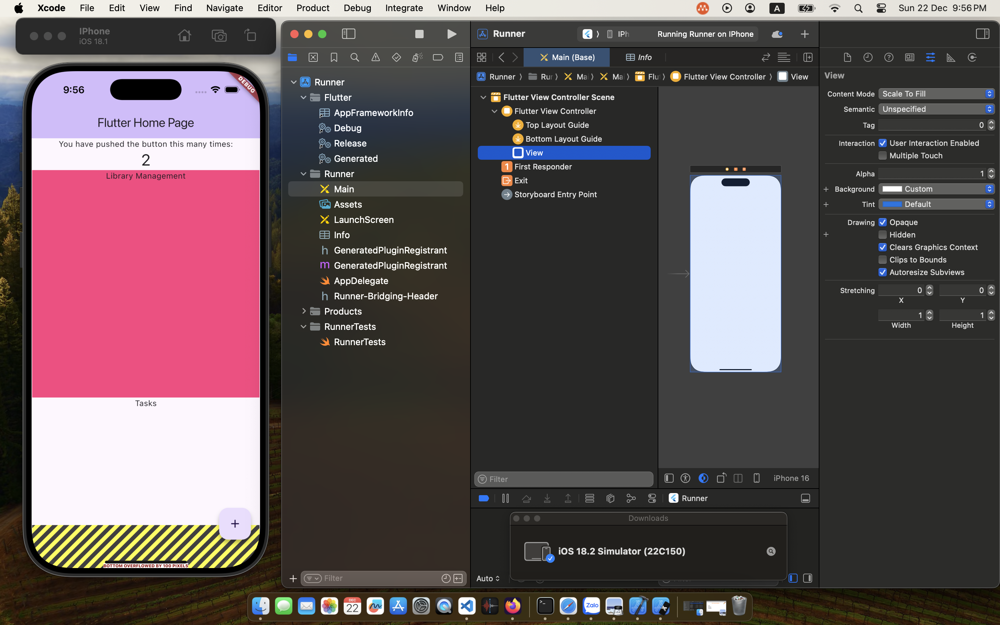
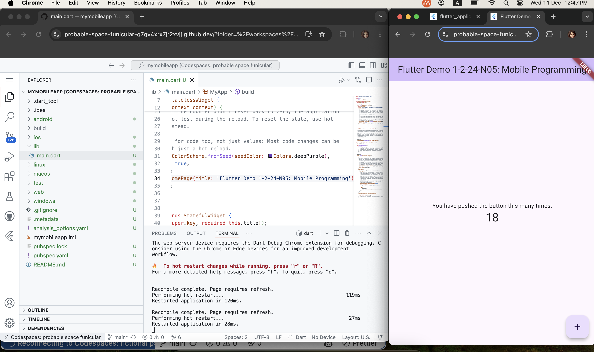

# CSE702027

# Setup and Run

## Setup to run Flutter App on Android Mobile Device Simulation
[Setup Flutter App on Android](https://lethunguyen.github.io/MobileDev/Simulation)

## Setup to run Flutter App on IPhone Device Simulation

[Setup Flutter App on Android](https://lethunguyen.github.io/MobileDev/IOSSimulation)

## Setup to run on WEB (Live Codespaces)

## Setup to run on WEB (Local 0.0.0.0:3000)

# Platform and Language

## Flutter Platform

https://flutter.dev/

## Dart

https://dartpad.dev/

https://dart.dev

## Get Started

https://docs.flutter.dev/get-started

Try Dart

https://dart.dev/language
On
https://dart.dev/#try-dart

# Introduction

## Giới thiệu về Flutter

### Lịch sử của Flutter và kiến trúc Flutter

[Google for Developer](https://www.youtube.com/watch?v=fq4N0hgOWzU)

### Tạo một ứng dụng trên Flutter

[Step by Step](https://codelabs.developers.google.com/codelabs/flutter-codelab-first#0)

### First App Example

[Your first flutter App](https://codelabs.developers.google.com/codelabs/flutter-codelab-first?hl=en#0)

[Example: Google for Developer: Create an app using Flutter](https://www.youtube.com/watch?v=W1pNjxmNHNQ)

[Codelab](https://codelabs.developers.google.com)

